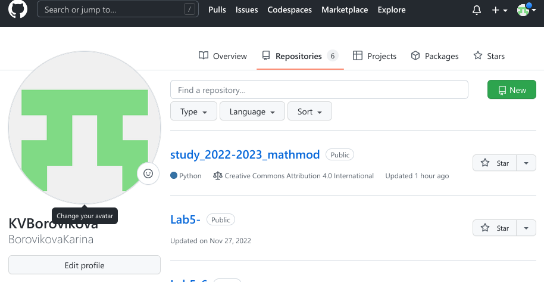
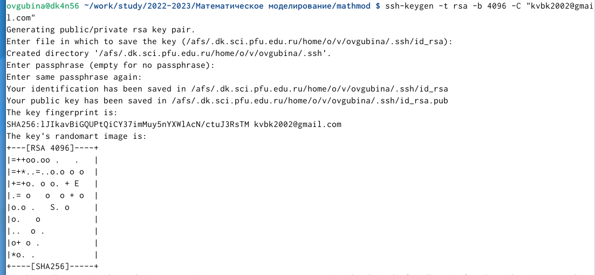
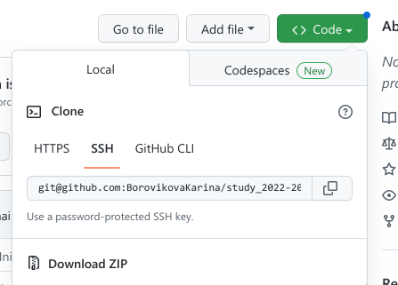
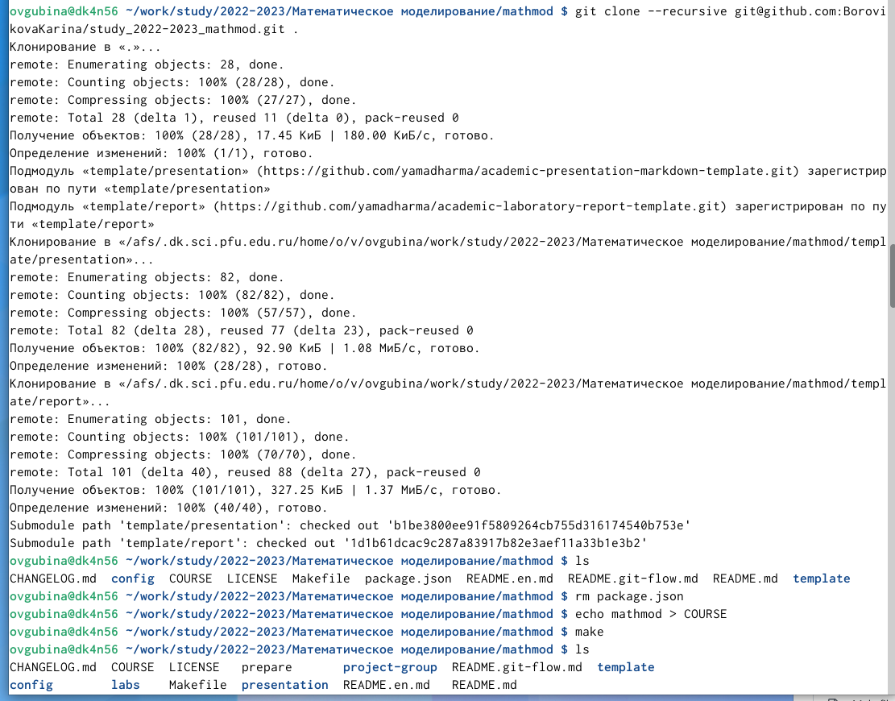
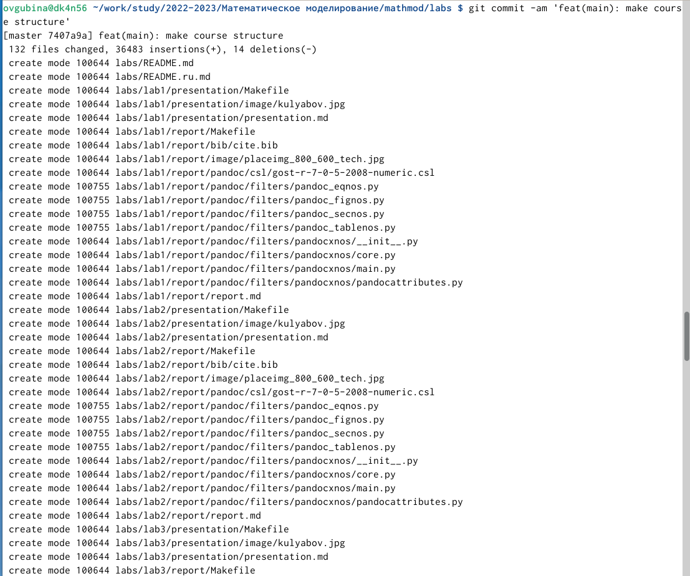
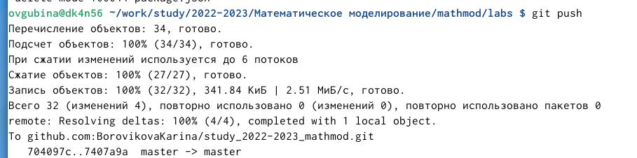
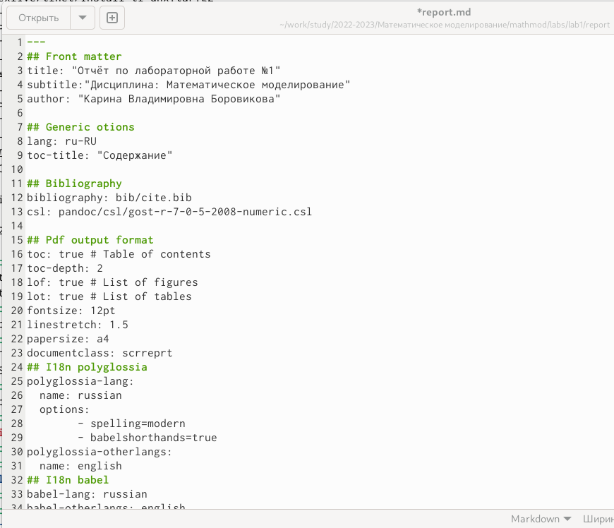

---
## Front matter
lang: ru-RU
title: Презентация к лабораторной работе №1
subtitle: Дисциплина: "Математическое модеирование"
author:
  - Боровикова К. В.
institute:
  - Российский университет дружбы народов, Москва, Россия
date: 11 февраля 2023

## i18n babel
babel-lang: russian
babel-otherlangs: english

## Formatting pdf
toc: false
toc-title: Содержание
slide_level: 2
aspectratio: 169
section-titles: true
theme: metropolis
header-includes:
 - \metroset{progressbar=frametitle,sectionpage=progressbar,numbering=fraction}
 - '\makeatletter'
 - '\beamer@ignorenonframefalse'
 - '\makeatother'
---

# Информация

## Докладчик

:::::::::::::: {.columns align=center}
::: {.column width="70%"}

  * Боровикова Карина Владимировна
  * студент группы НПИбд-01-20
  * Российский университет дружбы народов
  * [1032201748@pfur.ru](mailto:1032201748@pfur.ru)
  * <https://github.com/BorovikovaKarina>

:::
::: {.column width="30%"}

:::
::::::::::::::

# Вводная часть

## Актуальность

- Важность умения работы с репозиториями Git
- Необходимость быстрого написания презентаций и отчетов с использованием облегченного языка разметки Markdown

## Объект и предмет исследования

- Распределенная система управления версиями Git
- Облегченный язык разметки Markdown 

## Цели и задачи

- Создать репозиторий предмета на GitHub в соответствии с правилами оформления
- Написать отчет и презентацию на облегченном языке разметки Markdown

## Материалы и методы

- Процессор `pandoc` для входного формата Markdown
- Результирующие форматы
	- `pdf`
	- `html`
- Автоматизация процесса создания отчета в различных форматах: `Makefile`
- Репозиторий GitHub 

# Ход работы

## Создаем каталог для предмета в соответствии с указаниями лабораторной работы (рис. @fig:001).

{#fig:001 width=70%}

## Заходим на GitHub и создаем репозиторий для предмета, скопировав его из шаблона (рис. @fig:002).

{#fig:002 width=70%}

## Создаем пары ssh-ключей и добавляем публичный на GitHub (рис. @fig:003 - @fig:004).

{#fig:003 width=70%}
 
{#fig:004 width=70%}
 
## Заходим в созданный репозиторий и копируем ссылку на клонирование через ssh (рис. @fig:005).

{#fig:005 width=70%}

## Клонируем репозиторий на наше устройство и выполняем действия, указанные в настройках каталога курса:(рис. @fig:006 - @fig:009)
    
{#fig:006 width=70%}  
 
{#fig:007 width=70%} 

{#fig:008 width=70%} 

{#fig:009 width=70%} 
 
## Создаем отчет в Markdown (рис. @fig:010).

{#fig:010 width=70%} 

# Результаты

## Получающиеся форматы

- Полученный `pdf`-файл можно демонстрировать в любой программе просмотра `pdf`
- Полученный `html`-файл содержит в себе все ресурсы: изображения, css, скрипты

## Результаты

- Не нужны все результаты
- Необходимы логические связки между слайдами
- Необходимо показать понимание материала

## Итоговый слайд

- Запоминается последняя фраза. © Штирлиц
- Главное сообщение, которое вы хотите донести до слушателей
- Избегайте использовать последний слайд вида *Спасибо за внимание*

# Рекомендации

## Принцип 10/20/30

  - 10 слайдов
  - 20 минут на доклад
  - 30 кегль шрифта

## Связь слайдов

::: incremental

- Один слайд --- одна мысль
- Нельзя ссылаться на объекты, находящиеся на предыдущих слайдах (например, на формулы)
- Каждый слайд должен иметь заголовок

:::

## Количество сущностей

::: incremental

- Человек может одновременно помнить $7 \pm 2$ элемента
- При размещении информации на слайде старайтесь чтобы в сумме слайд содержал не более 5 элементов
- Можно группировать элементы так, чтобы визуально было не более 5 групп

:::

## Общие рекомендации

::: incremental

- На слайд выносится та информация, которая без зрительной опоры воспринимается хуже
- Слайды должны дополнять или обобщать содержание выступления или его частей, а не дублировать его
- Информация на слайдах должна быть изложена кратко, чётко и хорошо структурирована
- Слайд не должен быть перегружен графическими изображениями и текстом
- Не злоупотребляйте анимацией и переходами

:::

## Представление данных

::: incremental

- Лучше представить в виде схемы
- Менее оптимально представить в виде рисунка, графика, таблицы
- Текст используется, если все предыдущие способы отображения информации не подошли

:::

