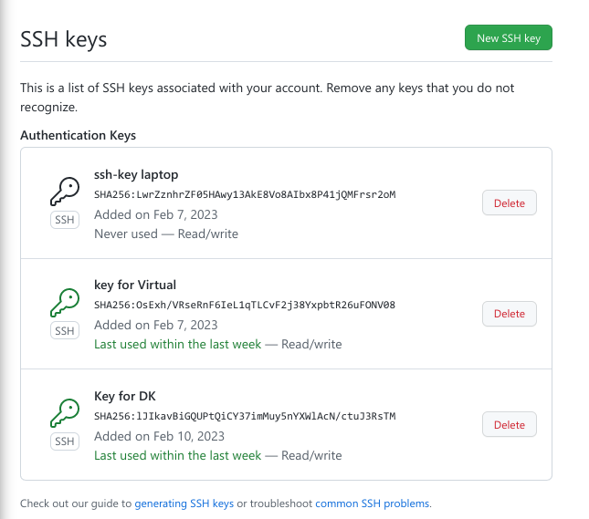

---
## Front matter
lang: ru-RU
title: Отчёт по лабораторной работе №1
author: |
	Боровикова Карина Владимировна
institute: |
	RUDN University, Moscow, Russian Federation
date: 2023, 11 февраля
place: Москва, Россия

## Formatting
toc: false
slide_level: 2
theme: metropolis
header-includes: 
 - \metroset{progressbar=frametitle,sectionpage=progressbar,numbering=fraction}
 - '\makeatletter'
 - '\beamer@ignorenonframefalse'
 - '\makeatother'
aspectratio: 43
section-titles: true
---

## Прагматика

- Важность умения работы с репозиториями Git
- Необходимость быстрого написания презентаций и отчетов с использованием облегченного языка разметки Markdown

## Объект и предмет исследования

- Распределенная система управления версиями Git
- Облегченный язык разметки Markdown 

## Цели и задачи

- Создать репозиторий предмета на GitHub в соответствии с правилами оформления
- Написать отчет и презентацию на облегченном языке разметки Markdown

## Ход работы

1. Создаем каталог для предмета в соответствии с указаниями лабораторной работы (рис. 1).

{#fig:001 width=70%}

## Ход работы

2. Заходим на GitHub и создаем репозиторий для предмета, скопировав его из шаблона (рис. 2).

{#fig:002 width=70%}

## Ход работы

3. Создаем пару ssh-ключей (рис. 3).

{#fig:003 width=70%}

## Ход работы

3. Добавляем публичный ключ на GitHub (рис. 4).
 
{#fig:004 width=70%}

## Ход работы

4. Заходим в созданный репозиторий и копируем ссылку на клонирование через ssh (рис. 5).

{#fig:005 width=70%}

## Ход работы

5. Клонируем репозиторий на наше устройство и выполняем действия, указанные в настройках каталога курса:(рис. 6)
    
{#fig:006 width=70%}  

## Ход работы

Клонируем репозиторий на наше устройство и выполняем действия, указанные в настройках каталога курса:(рис. 7)
 
{#fig:007 width=70%} 

## Ход работы

Клонируем репозиторий на наше устройство и выполняем действия, указанные в настройках каталога курса:(рис. 8)
    

{#fig:008 width=70%} 

## Ход работы

Клонируем репозиторий на наше устройство и выполняем действия, указанные в настройках каталога курса:(рис. 6-9)
    
{#fig:009 width=70%} 

## Ход работы

6. Создаем отчет в Markdown (рис. 10).

{#fig:010 width=70%} 

# Результаты

## Вывод

В ходе выолнения лабораторной работы мы создали репозиторий на GitHub в соответствии с необходимыми требованиями, а также написли отчет на облегченном языке разметки Markdown