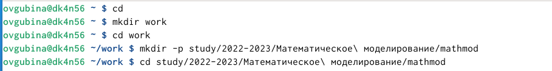
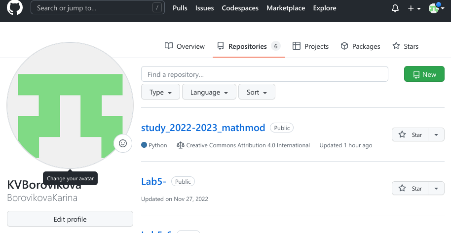
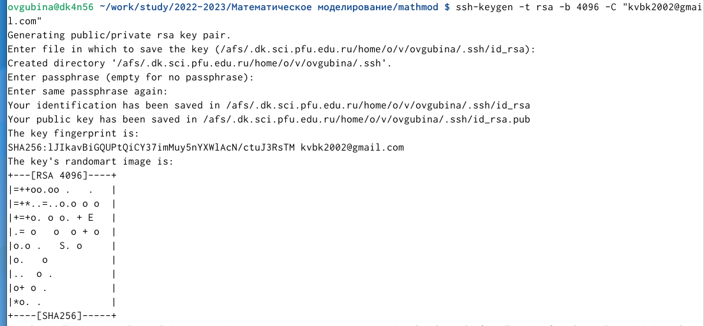
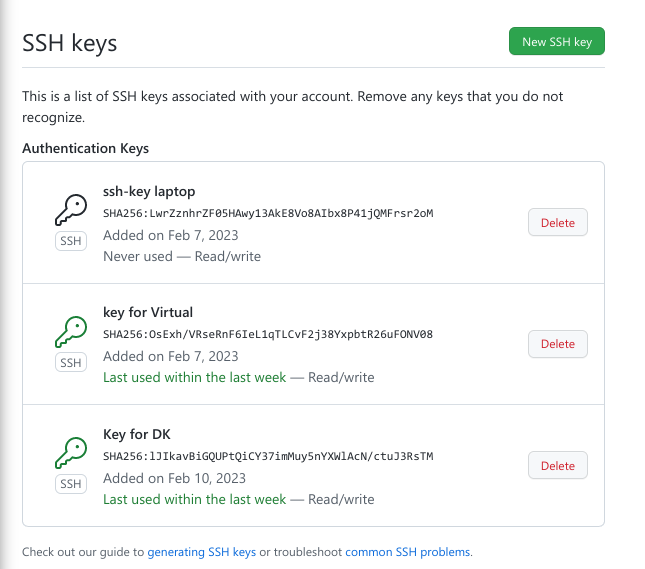
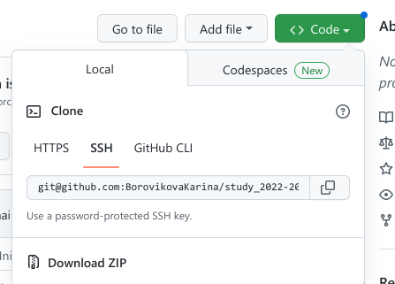
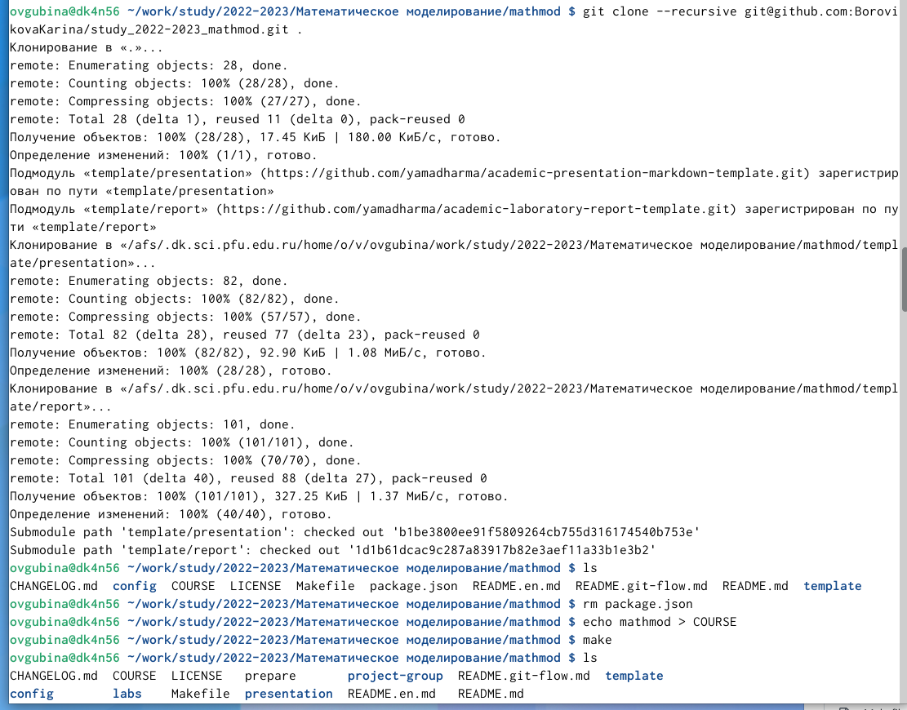
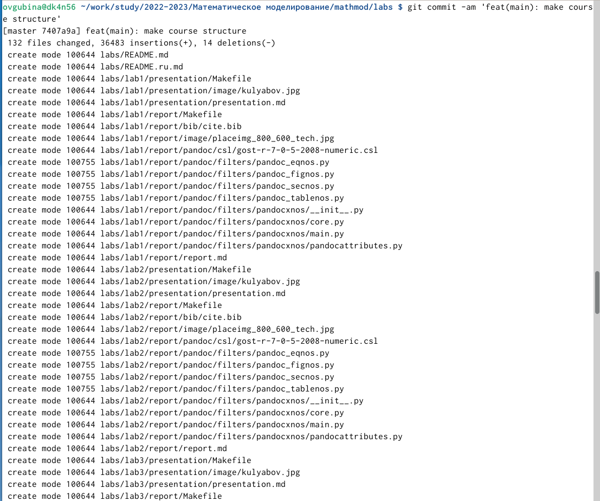
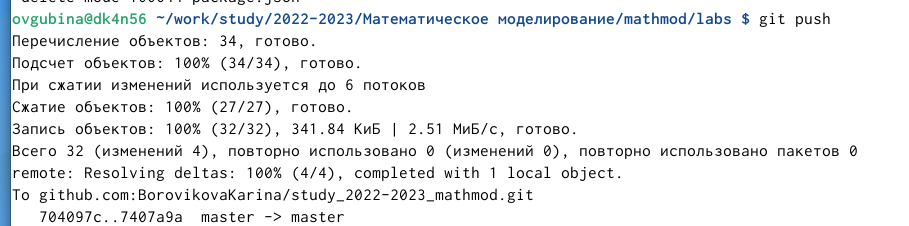
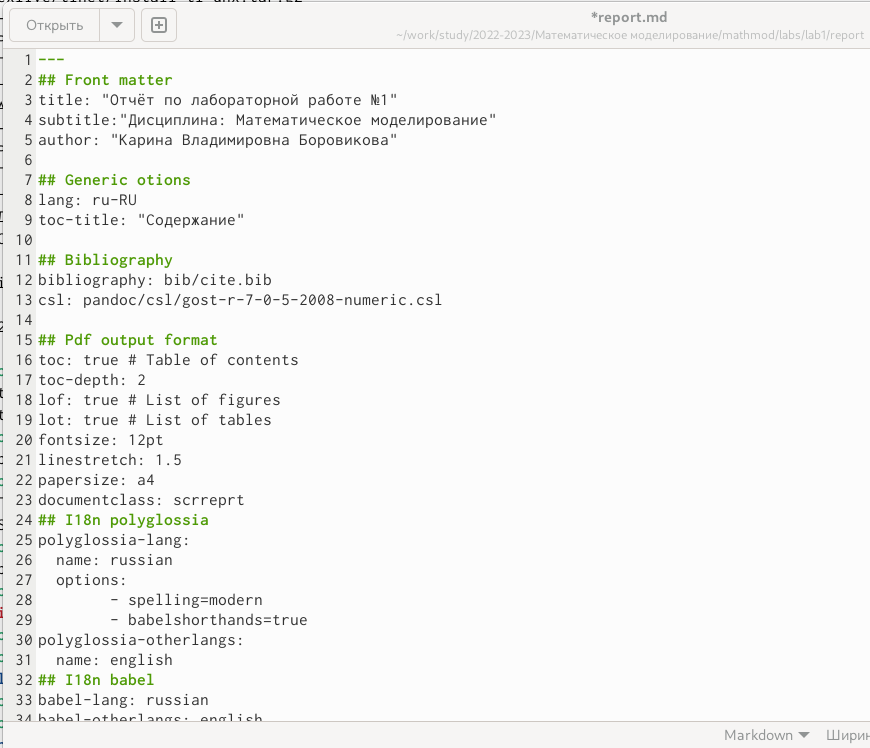

---
## Front matter
title: "Отчёт по лабораторной работе №1"
subtitle:"Дисциплина: Математическое моделирование"
author: "Карина Владимировна Боровикова"

## Generic otions
lang: ru-RU
toc-title: "Содержание"

## Bibliography
bibliography: bib/cite.bib
csl: pandoc/csl/gost-r-7-0-5-2008-numeric.csl

## Pdf output format
toc: true # Table of contents
toc-depth: 2
lof: true # List of figures
lot: true # List of tables
fontsize: 12pt
linestretch: 1.5
papersize: a4
documentclass: scrreprt
## I18n polyglossia
polyglossia-lang:
  name: russian
  options:
	- spelling=modern
	- babelshorthands=true
polyglossia-otherlangs:
  name: english
## I18n babel
babel-lang: russian
babel-otherlangs: english
## Fonts
mainfont: PT Serif
romanfont: PT Serif
sansfont: PT Sans
monofont: PT Mono
mainfontoptions: Ligatures=TeX
romanfontoptions: Ligatures=TeX
sansfontoptions: Ligatures=TeX,Scale=MatchLowercase
monofontoptions: Scale=MatchLowercase,Scale=0.9
## Biblatex
biblatex: true
biblio-style: "gost-numeric"
biblatexoptions:
  - parentracker=true
  - backend=biber
  - hyperref=auto
  - language=auto
  - autolang=other*
  - citestyle=gost-numeric
## Pandoc-crossref LaTeX customization
figureTitle: "Рис."
tableTitle: "Таблица"
listingTitle: "Листинг"
lofTitle: "Список иллюстраций"
lotTitle: "Список таблиц"
lolTitle: "Листинги"
## Misc options
indent: true
header-includes:
  - \usepackage{indentfirst}
  - \usepackage{float} # keep figures where there are in the text
  - \floatplacement{figure}{H} # keep figures where there are in the text
---

# Цель работы

Получение навыков создания репозитория на GitHub в соответствии с требованиями, а также написания отчета с использованием  облгченного языка разметки Markdown. 

# Задание

- Создание репозитория на GitHub
- Написание отчета в формате .md

# Теоретическое введение

Данная лабораторная работа подразумевает использование распределенной системы управлния версиями Git. 
Система Git была изначально разработана в 2005 году Линусом Торвальдсом — создателем ядра операционной системы Linux. Git применяется для управления версиями в рамках колоссального количества проектов по разработке ПО, как коммерческих, так и с открытым исходным кодом. Система используется множеством профессиональных разработчиков программного обеспечения. Она превосходно работает под управлением различных операционных систем и может применяться со множеством интегрированных сред разработки (IDE) [@link2].

Для подготовки используем следующие команды, чтобы гит узнал наше имя и электронную почту 

git config --global user.name "Your Name"
git config --global user.email "your_email@whatever.com"

Также в лабораторной работе мы будем использовать Markdown — облегчённый язык разметки, созданный с целью обозначения форматирования в простом тексте, с максимальным сохранением его читаемости человеком, и пригодный для машинного преобразования в языки для продвинутых публикаций [@link1].

# Выполнение лабораторной работы

1. Создаем каталог для предмета в соответствии с указаниями лабораторной работы (рис. @fig:001).

{#fig:001 width=70%}

2. Заходим на GitHub и создаем репозиторий для предмета, скопировав его из шаблона (рис. @fig:002).

{#fig:002 width=70%}

3. Создаем пары ssh-ключей и добавляем публичный на GitHub (рис. @fig:003 - @fig:004).

{#fig:003 width=70%}
 
{#fig:004 width=70%}
 
4. Заходим в созданный репозиторий и копируем ссылку на клонирование через ssh (рис. @fig:005).

{#fig:005 width=70%}

5. Клонируем репозиторий на наше устройство и выполняем действия, указанные в настройках каталога курса:(рис. @fig:006 - @fig:009)
    
  - Перейдите в каталог курса:

    cd ~/work/study/2022-2023/"Математическое моделирование"/mathmod

  - Удалите лишние файлы:

    rm package.json

  - Создайте необходимые каталоги:

    echo mathmod > COURSE
    make

  - Отправьте файлы на сервер:

    git add .
    git commit -am 'feat(main): make course structure'
    git push
    
{#fig:006 width=70%}  
 
{#fig:007 width=70%} 

{#fig:008 width=70%} 

{#fig:009 width=70%} 
 
6. Создаем отчет в Markdown (рис. @fig:010).

{#fig:010 width=70%} 

# Выводы

В ходе выолнения лабораторной работы мы создали репозиторий на GitHub в соответствии с необходимыми требованиями, а также написли отчет на облегченном языке разметки Markdown

# Список литературы{.unnumbered}

::: {#refs}
:::
