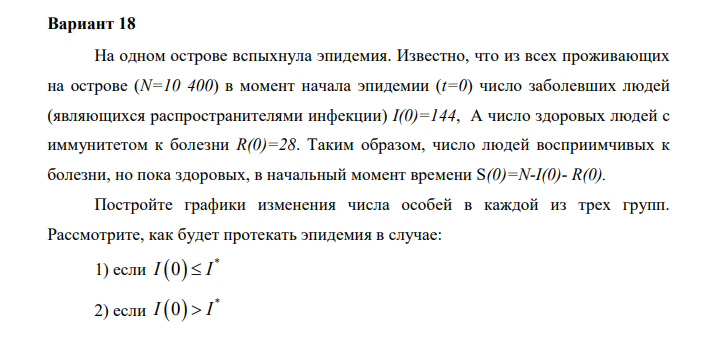
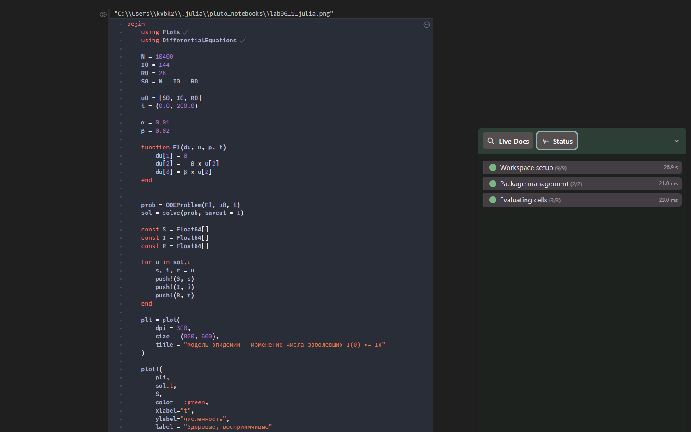
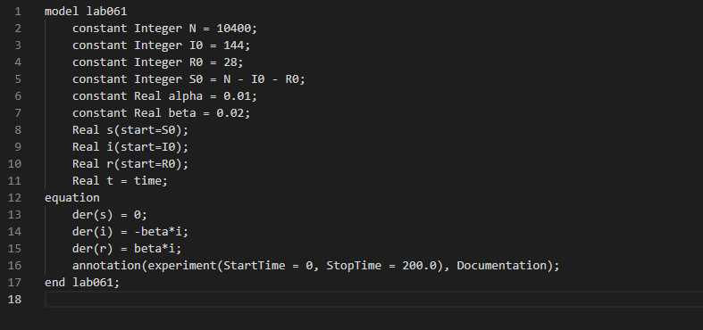
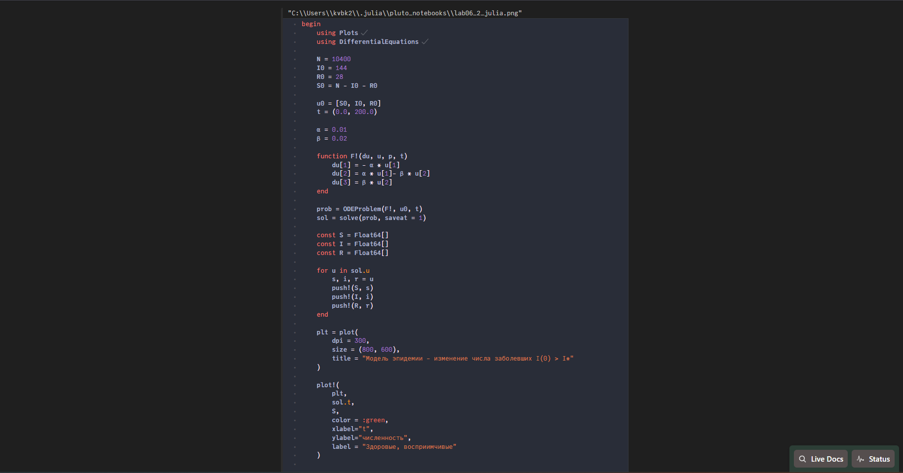
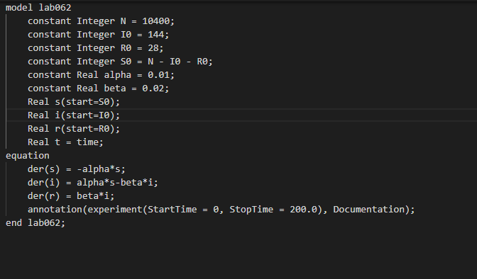
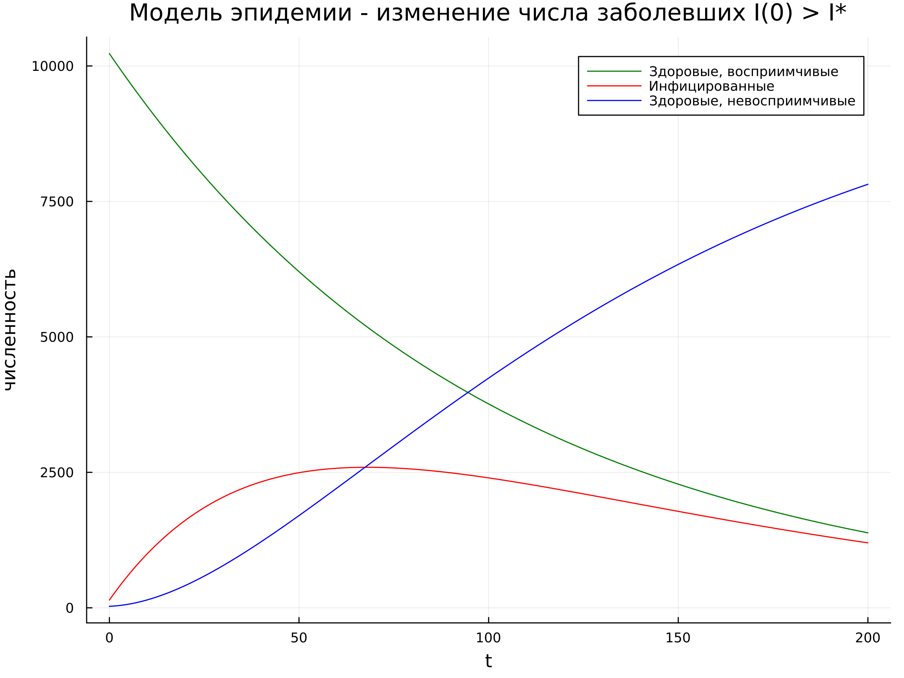
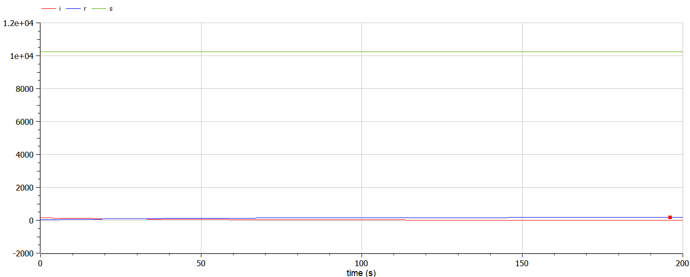
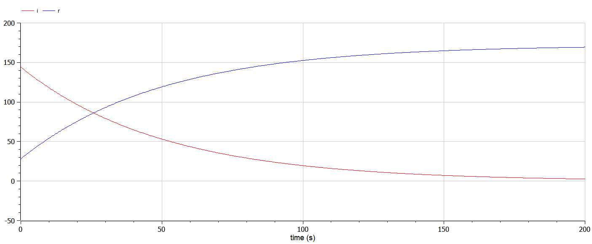
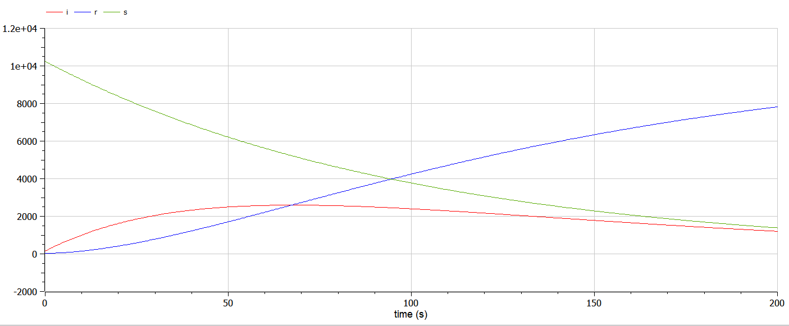

---
## Front matter
lang: ru-RU
title: Отчёт по лабораторной работе №3
author: |
	Боровикова Карина Владимировна
institute: |
	RUDN University, Moscow, Russian Federation
date: 2023, 11 февраля
place: Москва, Россия

## Formatting
toc: false
slide_level: 2
theme: metropolis
header-includes: 
 - \metroset{progressbar=frametitle,sectionpage=progressbar,numbering=fraction}
 - '\makeatletter'
 - '\beamer@ignorenonframefalse'
 - '\makeatother'
aspectratio: 43
section-titles: true
---

## Прагматика

- Важность умения работы с языками Julia и OpenModelica в части математического моделирования

## Объект и предмет исследования

- Язык Julia
- Язык OpenModelica
- Моделирование задачи об эпидемии

## Цели и задачи
*Цель работы:* 

Целью данной лабораторной работы является создание модели эпидемии с помощью языков Julia и OpenModelica. Построить соответствующие графики двух случаев.

*Задачи:*

- Рассмотреть процесс распространения эпидемии в двух случаях: I(0) <= I* и I(0) > I*

- Построить графики изменения количества особей в каждой из трех категорий особей: I(t) - инфицированные особи, S(t) - восприимчивые к болезни здоровые особи, R(t) - здоровые особи с иммунитетом к болезни.

## Ход работы

1. Рассматриваем задачу об эпидемии (рис. 1).

{#fig:001 width=60%}

## Ход работы

2. Программируем первый случай на Julia (рис. 2).

{#fig:002 width=70%}

## Ход работы

3. Программируем первый случай на OpenModelica (рис. 3).

{#fig:003 width=70%}

## Ход работы

4. Программируем второй случай на Julia (рис. 4).

{#fig:004 width=70%}

## Ход работы

5. Программируем второй случай на OpenModelica (рис. 5).

{#fig:005 width=70%}

## Ход работы

6. Запускаем код через терминал, получаем изображения для первого и второго случаев на Julia (рис. 6).
 
{#fig:006 width=70%} 

## Ход работы

7. Запускаем код через терминал, получаем изображения для первого и второго случаев на Julia (рис. 7).
 
{#fig:007 width=70%} 

## Ход работы

8. Запускаем код через терминал, получаем изображения для первого и второго случаев на OpenModelica (рис. 8).
 
{#fig:008 width=70%} 

## Ход работы

9. Запускаем код через терминал, получаем изображения для первого и второго случаев на OpenModelica (рис. 9).
 
{#fig:009 width=70%} 

10. Запускаем код через терминал, получаем изображения для первого и второго случаев на OpenModelica (рис. 9).
 
{#fig:009 width=70%} 

# Результаты

## Вывод

В ходе выполнения лабораторной работы я построила модель задачи об эпидемии с помощью языков Julia и OpenModelica, построила графики изменения количества особей трех категорий - S(t) - восприимчивые к болезни, но здоровые особи, I(t) - инфицированные особиб R(t) - здоровые особи с иммунитетом к болезни в двух различных случаях.