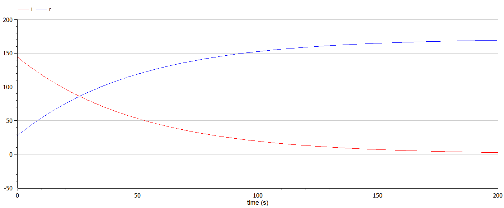

---
## Front matter
title: "Лабораторная работа №6"
subtitle: "Предмет: математическое моделирование"
author: "Боровикова Карина Владимировна"

## Generic otions
lang: ru-RU
toc-title: "Содержание"

## Bibliography
bibliography: bib/cite.bib
csl: pandoc/csl/gost-r-7-0-5-2008-numeric.csl

## Pdf output format
toc: true # Table of contents
toc-depth: 2
lof: true # List of figures
lot: true # List of tables
fontsize: 12pt
linestretch: 1.5
papersize: a4
documentclass: scrreprt
## I18n polyglossia
polyglossia-lang:
  name: russian
  options:
	- spelling=modern
	- babelshorthands=true
polyglossia-otherlangs:
  name: english
## I18n babel
babel-lang: russian
babel-otherlangs: english
## Fonts
mainfont: PT Serif
romanfont: PT Serif
sansfont: PT Sans
monofont: PT Mono
mainfontoptions: Ligatures=TeX
romanfontoptions: Ligatures=TeX
sansfontoptions: Ligatures=TeX,Scale=MatchLowercase
monofontoptions: Scale=MatchLowercase,Scale=0.9
## Biblatex
biblatex: true
biblio-style: "gost-numeric"
biblatexoptions:
  - parentracker=true
  - backend=biber
  - hyperref=auto
  - language=auto
  - autolang=other*
  - citestyle=gost-numeric
## Pandoc-crossref LaTeX customization
figureTitle: "Рис."
tableTitle: "Таблица"
listingTitle: "Листинг"
lofTitle: "Список иллюстраций"
lotTitle: "Список таблиц"
lolTitle: "Листинги"
## Misc options
indent: true
header-includes:
  - \usepackage{indentfirst}
  - \usepackage{float} # keep figures where there are in the text
  - \floatplacement{figure}{H} # keep figures where there are in the text
---

# Цель работы

Построить модель для задачи об эпидемии с помощью языков Julia и OpenModelica

# Задание

- Рассмотреть процесс распространения эпидемии в двух случаях: I(0) <= I* и I(0) > I*

- Построить графики изменения количества особей в каждой из трех категорий особей: I(t) - инфицированные особи, S(t) - восприимчивые к болезни здоровые особи, R(t) - здоровые особи с иммунитетом к болезни.

# Теоретическое введение

Рассмотрим простейшую модель эпидемии. Предположим, что некая
популяция, состоящая из N особей, (считаем, что популяция изолирована)
подразделяется на три группы. Первая группа - это восприимчивые к болезни, но
пока здоровые особи, обозначим их через S(t). Вторая группа – это число
инфицированных особей, которые также при этом являются распространителями
инфекции, обозначим их I(t). А третья группа, обозначающаяся через R(t) – это
здоровые особи с иммунитетом к болезни. 

Поскольку каждая восприимчивая к болезни особь, которая, в конце концов,
заболевает, сама становится инфекционной, то скорость изменения числа
инфекционных особей представляет разность за единицу времени между
заразившимися и теми, кто уже болеет и лечится. 

Постоянные пропорциональности
Alpha и Beta, - это коэффициенты заболеваемости
и выздоровления соответственно.
Для того, чтобы решения соответствующих уравнений определялось
однозначно, необходимо задать начальные условия .Считаем, что на начало
эпидемии в момент времени
t = 0 нет особей с иммунитетом к болезни R(0)=0, а
число инфицированных и восприимчивых к болезни особей
I(0) и
S(0) соответственно. Для анализа картины протекания эпидемии необходимо
рассмотреть два случая:

а) I(0) <= I*  

б) I(0) > I* [@link1].

# Выполнение лабораторной работы

1. Задание для выполнения:

На одном острове вспыхнула эпидемия. Известно, что из всех проживающих
на острове (N=10 400) в момент начала эпидемии (t=0) число заболевших людей
(являющихся распространителями инфекции) I(0)=144, А число здоровых людей с
иммунитетом к болезни R(0)=28. Таким образом, число людей восприимчивых к
болезни, но пока здоровых, в начальный момент времени S(0)=N-I(0)- R(0).
Постройте графики изменения числа особей в каждой из трех групп.
Рассмотрите, как будет протекать эпидемия в случае:
1) если I(0)<= I*
2) если I(0)> I*.

Значения коэффициентов возьмем для alpha равным 0.01, для beta равным 0.02

2. Рассмотрим первый случай I(t) <= I*:

а) Напишем код на языке Julia с использованием Pluto:
```
begin
	using Plots
	using DifferentialEquations

	N = 10400
	I0 = 144
	R0 = 28
	S0 = N - I0 - R0

	u0 = [S0, I0, R0]
	t = (0.0, 200.0)

	α = 0.01
	β = 0.02

	function F!(du, u, p, t)
		du[1] = 0
		du[2] = - β * u[2]
		du[3] = β * u[2] 
	end

	
	prob = ODEProblem(F!, u0, t)
	sol = solve(prob, saveat = 1)

	const S = Float64[]
	const I = Float64[]
	const R = Float64[]

	for u in sol.u
		s, i, r = u
		push!(S, s)
		push!(I, i)
		push!(R, r)
	end

	plt = plot(
		dpi = 300,
		size = (800, 600),
		title = "Модель эпидемии - изменение числа заболевших I(0) <= I*"
	)

	plot!(
		plt,
		sol.t,
		S,
		color = :green,
		xlabel="t",
		ylabel="численность",
		label = "Здоровые, восприимчивые"
	)
	
	plot!(
		plt,
		sol.t,
		I,
		color = :red,
		xlabel="t",
		ylabel="численность",
		label = "Инфицированные"
	)
	
	plot!(
		plt,
		sol.t,
		R,
		color = :blue,
		xlabel="t",
		ylabel="численность",
		label = "Здоровые, невосприимчивые"
	)
	
	savefig(plt, "lab06_1_julia.png")
end
```

Результатом его выполнения являяется рисунок lab06_1_julia.png(рис. @fig:001).

{#fig:001 width=70%}

б) Далее пишем код на OpenModelica:

```
model lab061
    constant Integer N = 10400;
    constant Integer I0 = 144;
    constant Integer R0 = 28;
    constant Integer S0 = N - I0 - R0;
    constant Real alpha = 0.01;
    constant Real beta = 0.02;
    Real s(start=S0);
    Real i(start=I0);
    Real r(start=R0);
    Real t = time;
equation
    der(s) = 0;
    der(i) = -beta*i;
    der(r) = beta*i;
    annotation(experiment(StartTime = 0, StopTime = 200.0), Documentation);
end lab061;
```
Результатом его работы будет являться следующий график: (рис. @fig:002).

{#fig:002 width=70%}

Для большей наглядности приблизим график, убрав отображение графика S(t)

{#fig:003 width=70%}

3. Рассмотрим второй случай I(t) > I*:

а) Напишем код на языке Julia с использованием Pluto:
```
begin
	using Plots
	using DifferentialEquations

	N = 10400
	I0 = 144
	R0 = 28
	S0 = N - I0 - R0

	u0 = [S0, I0, R0]
	t = (0.0, 200.0)

	α = 0.01
	β = 0.02

	function F!(du, u, p, t)
		du[1] = - α * u[1]
		du[2] = α * u[1]- β * u[2]
		du[3] = β * u[2] 
	end

	prob = ODEProblem(F!, u0, t)
	sol = solve(prob, saveat = 1)

	const S = Float64[]
	const I = Float64[]
	const R = Float64[]

	for u in sol.u
		s, i, r = u
		push!(S, s)
		push!(I, i)
		push!(R, r)
	end

	plt = plot(
		dpi = 300,
		size = (800, 600),
		title = "Модель эпидемии - изменение числа заболевших I(0) > I*"
	)

	plot!(
		plt,
		sol.t,
		S,
		color = :green,
		xlabel="t",
		ylabel="численность",
		label = "Здоровые, восприимчивые"
	)
	
	
	plot!(
		plt,
		sol.t,
		I,
		color = :red,
		xlabel="t",
		ylabel="численность",
		label = "Инфицированные"
	)
	
	plot!(
		plt,
		sol.t,
		R,
		color = :blue,
		xlabel="t",
		ylabel="численность",
		label = "Здоровые, невосприимчивые"
	)
	
	savefig(plt, "lab06_2_julia.png")
end
```

Результатом его выполнения являяется рисунок lab06_2_julia.png(рис. @fig:004).

{#fig:004 width=70%}

б) Далее пишем код на OpenModelica:

```
model lab062
    constant Integer N = 10400;
    constant Integer I0 = 144;
    constant Integer R0 = 28;
    constant Integer S0 = N - I0 - R0;
    constant Real alpha = 0.01;
    constant Real beta = 0.02;
    Real s(start=S0);
    Real i(start=I0);
    Real r(start=R0);
    Real t = time;
equation
    der(s) = -alpha*s;
    der(i) = alpha*s-beta*i;
    der(r) = beta*i;
    annotation(experiment(StartTime = 0, StopTime = 200.0), Documentation);
end lab062;
```
Результатом его работы будет являться следующий график: (рис. @fig:004).

{#fig:005 width=70%}

# Выводы

В ходе выполнения лабораторной работы я построила модель задачи об эпидемии с помощью языков Julia и OpenModelica, построила графики изменения количества особей трех категорий - S(t) - восприимчивые к болезни, но здоровые особи, I(t) - инфицированные особиб R(t) - здоровые особи с иммунитетом к болезни в двух различных случаях.

# Список литературы{.unnumbered}

::: {#refs}
:::
