---
## Front matter
lang: ru-RU
title: Презентация к лабораторной работе №7
author: |
	Боровикова Карина Владимировна
institute: |
	RUDN University, Moscow, Russian Federation
date: 2023, 25 марта
place: Москва, Россия

## Formatting
toc: false
slide_level: 2
theme: metropolis
header-includes: 
 - \metroset{progressbar=frametitle,sectionpage=progressbar,numbering=fraction}
 - '\makeatletter'
 - '\beamer@ignorenonframefalse'
 - '\makeatother'
aspectratio: 43
section-titles: true
---

## Прагматика

- Важность умения работы с языками Julia и OpenModelica в части математического моделирования

## Объект и предмет исследования

- Язык Julia
- Язык OpenModelica
- Моделирование задачи о распространении рекламы

## Цели и задачи
*Цель работы:* 

Построить модель для задачи о распространении рекламы с помощью языков Julia и OpenModelica для трех случаев

*Задачи:*

- Построить графики распространения рекламы, математическая модель которой описывается уравнениями в задании к лабораторной работе №7 для трех случаев при N = 1224, n = 14

- Для случая 2 определить, в какой момент времени скорость распространения рекламы будет иметь максимальное значение.

## Ход работы

1. Рассматриваем задачу о распространении рекламы (рис. 1).

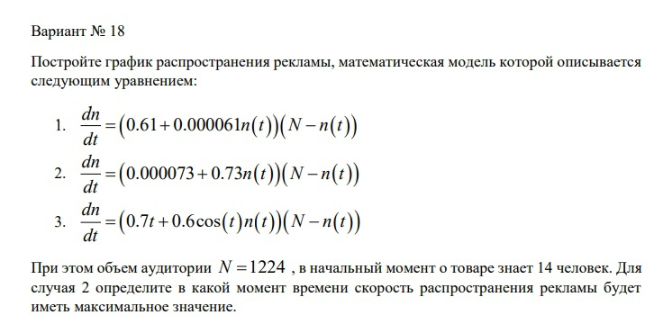{#fig:001 width=60%}

## Ход работы

2. Программируем первый случай на Julia (рис. 2).

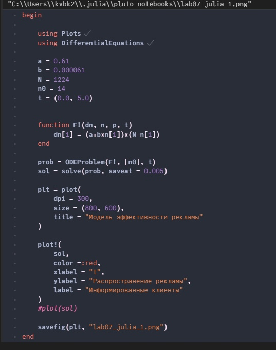{#fig:002 width=70%}

## Ход работы

3. Программируем первый случай на OpenModelica (рис. 3).

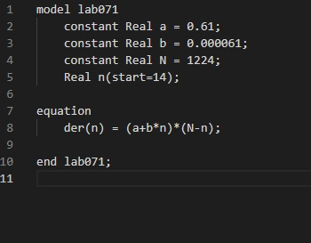{#fig:003 width=70%}

## Ход работы

4. Программируем второй случай на Julia (рис. 4).

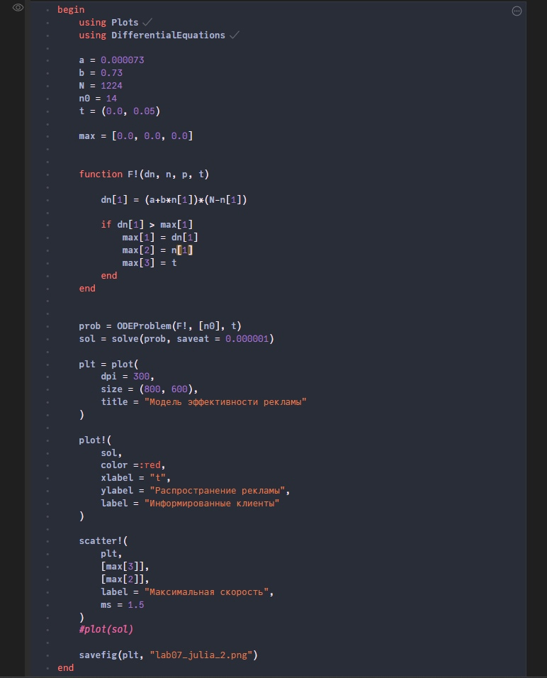{#fig:004 width=70%}

## Ход работы

5. Программируем второй случай на OpenModelica (рис. 5).

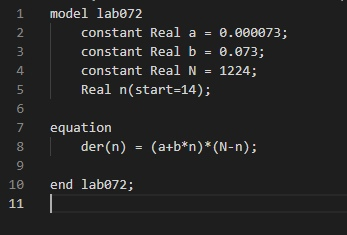{#fig:005 width=70%}

## Ход работы

6. Программируем третий случай на Julia (рис. 6).

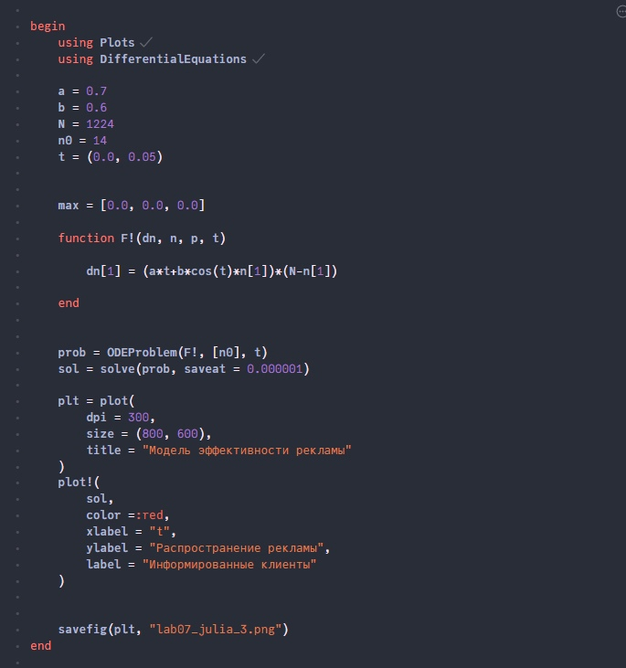{#fig:006 width=70%}

## Ход работы

7. Программируем третий случай на OpenModelica (рис. 7).

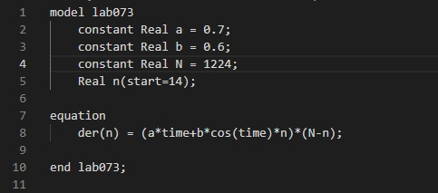{#fig:007 width=70%}

## Ход работы

6. Запускаем код через терминал, получаем изображения для случаев на Julia (рис. 8).
 
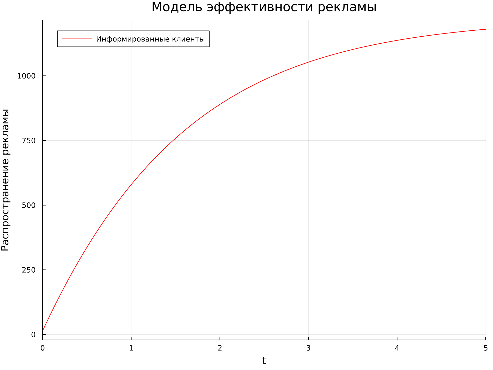{#fig:008 width=70%} 

## Ход работы

7. Запускаем код через терминал, получаем изображения случаев на Julia (рис. 9).
 
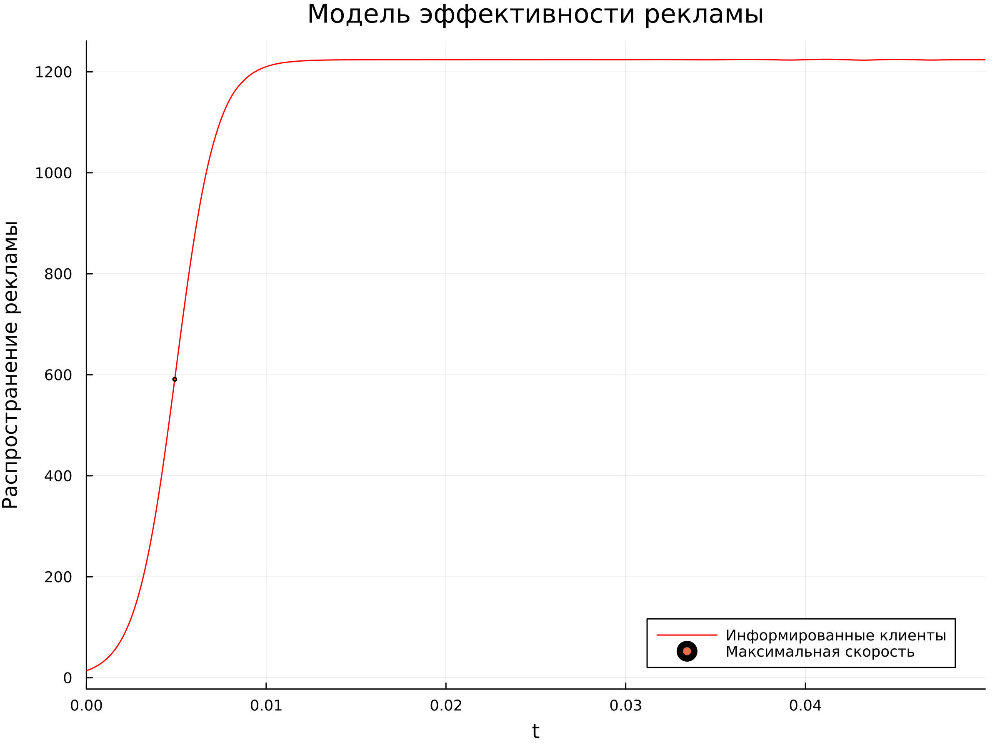{#fig:009 width=70%} 

## Ход работы

8. Запускаем код через терминал, получаем изображения случаев на Julia (рис. 10).
 
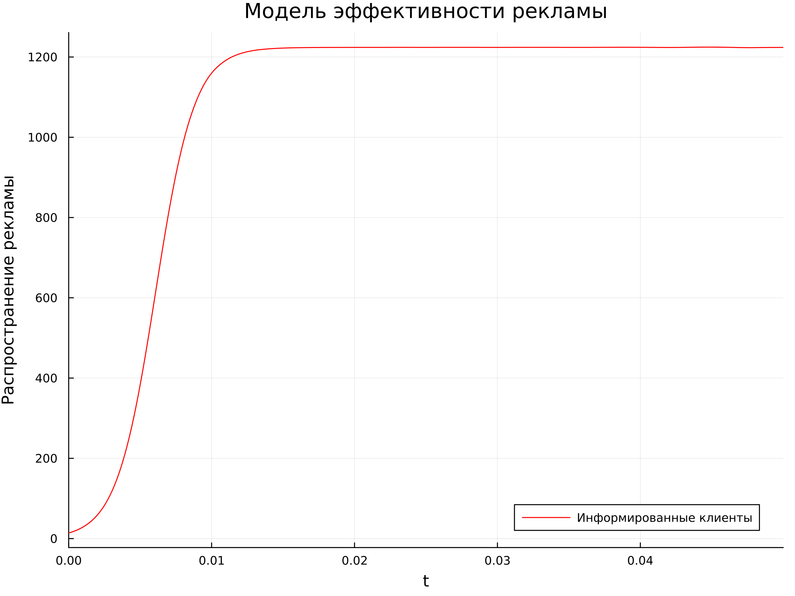{#fig:010 width=70%} 

## Ход работы

9. Запускаем код через терминал, получаем изображения для случаев на OpenModelica (рис. 11).
 
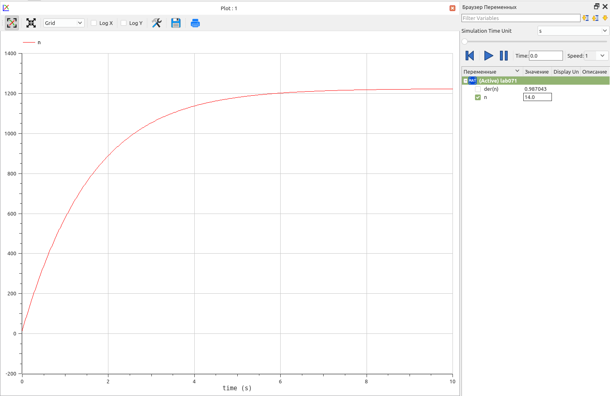{#fig:011 width=70%} 

## Ход работы

9. Запускаем код через терминал, получаем изображения длz случаев на OpenModelica (рис. 12).
 
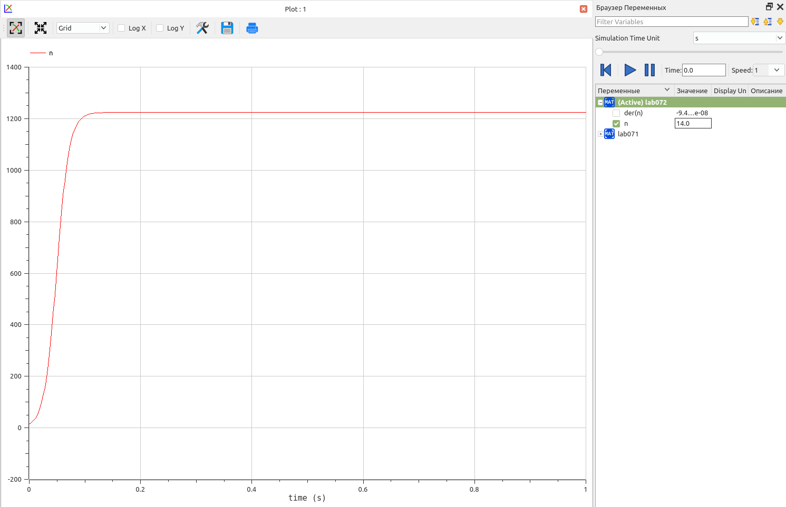{#fig:012 width=70%} 

10. Запускаем код через терминал, получаем изображения для случаев на OpenModelica (рис. 13).
 
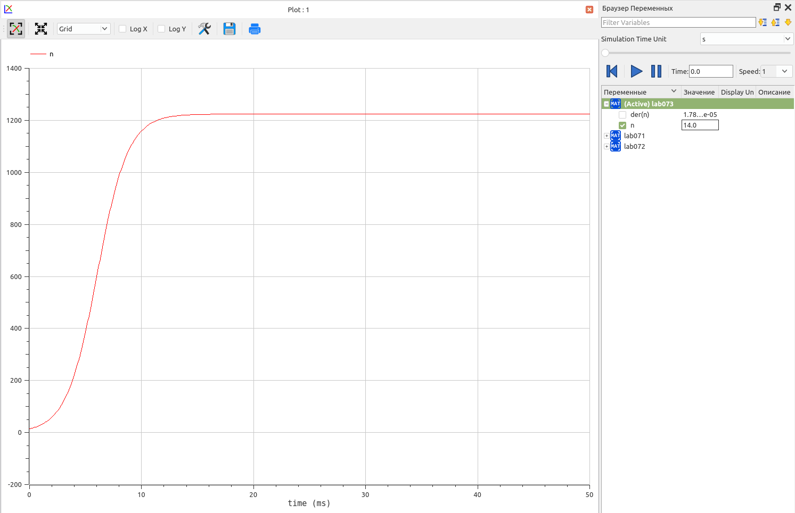{#fig:013 width=70%} 

# Результаты

## Вывод

В ходе выполнения лабораторной работы мне удалось построить модель для задачи о распространении рекламы с помощью языков Julia и OpenModelica в трех случаях
