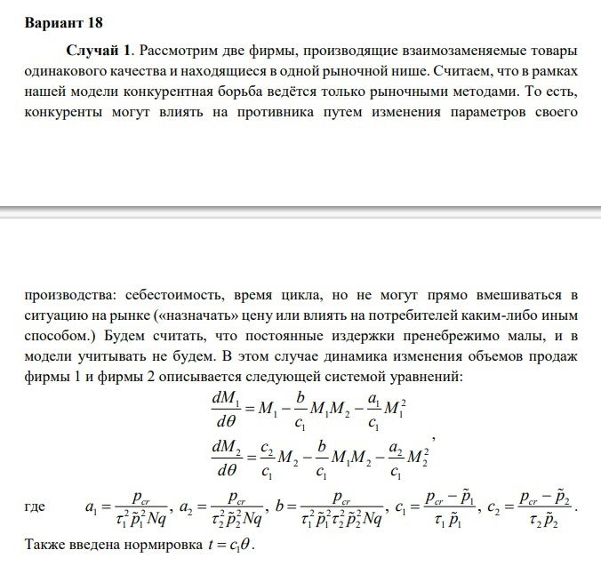
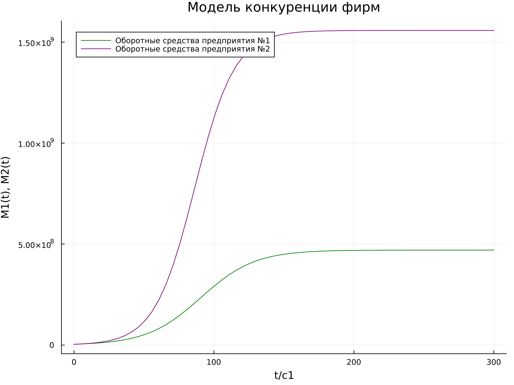
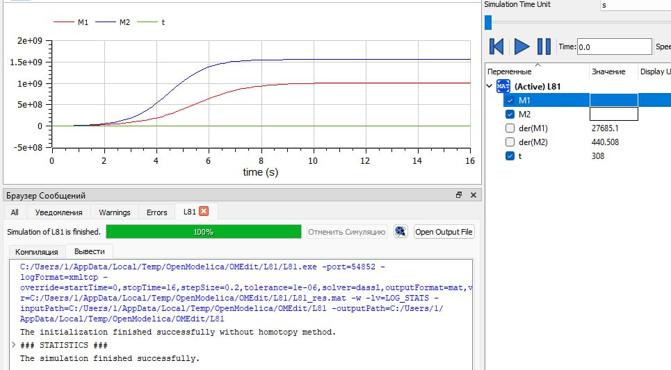
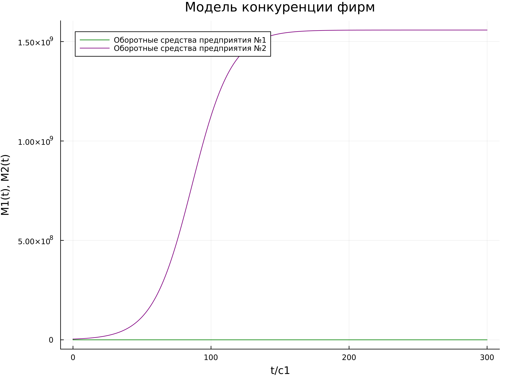
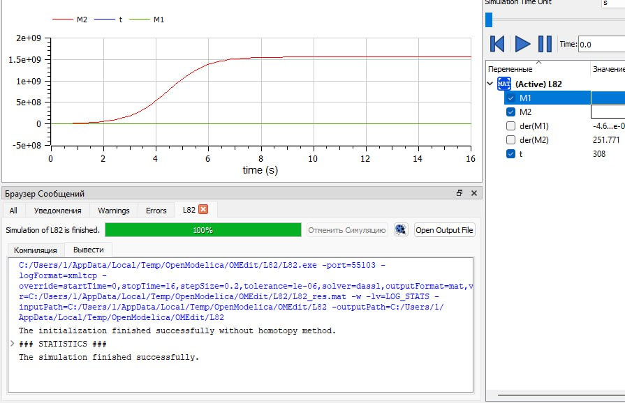

---
## Front matter
title: "Лабораторная работа №8"
subtitle: "Предмет: математическое моделирование"
author: "Боровикова Карина Владимировна"

## Generic otions
lang: ru-RU
toc-title: "Содержание"

## Bibliography
bibliography: bib/cite.bib
csl: pandoc/csl/gost-r-7-0-5-2008-numeric.csl

## Pdf output format
toc: true # Table of contents
toc-depth: 2
lof: true # List of figures
lot: true # List of tables
fontsize: 12pt
linestretch: 1.5
papersize: a4
documentclass: scrreprt
## I18n polyglossia
polyglossia-lang:
  name: russian
  options:
	- spelling=modern
	- babelshorthands=true
polyglossia-otherlangs:
  name: english
## I18n babel
babel-lang: russian
babel-otherlangs: english
## Fonts
mainfont: PT Serif
romanfont: PT Serif
sansfont: PT Sans
monofont: PT Mono
mainfontoptions: Ligatures=TeX
romanfontoptions: Ligatures=TeX
sansfontoptions: Ligatures=TeX,Scale=MatchLowercase
monofontoptions: Scale=MatchLowercase,Scale=0.9
## Biblatex
biblatex: true
biblio-style: "gost-numeric"
biblatexoptions:
  - parentracker=true
  - backend=biber
  - hyperref=auto
  - language=auto
  - autolang=other*
  - citestyle=gost-numeric
## Pandoc-crossref LaTeX customization
figureTitle: "Рис."
tableTitle: "Таблица"
listingTitle: "Листинг"
lofTitle: "Список иллюстраций"
lotTitle: "Список таблиц"
lolTitle: "Листинги"
## Misc options
indent: true
header-includes:
  - \usepackage{indentfirst}
  - \usepackage{float} # keep figures where there are in the text
  - \floatplacement{figure}{H} # keep figures where there are in the text
---

# Цель работы

Построить модель для задачи о конкуренциидвух фирм с помощью языков Julia и OpenModelica

# Задание

- Построить графики изменения оборотных средств фирмы 1 и фирмы 2 без учета постоянных издержек и с введенной нормировкой для случая 1.

- Построить графики изменения оборотных средств фирмы 1 и фирмы 2 без учета постоянных издержек и с введенной нормировкой для случая 2.

# Теоретическое введение

_Случай 1._ Рассмотрим две фирмы, производящие взаимозаменяемые товары
одинакового качества и находящиеся в одной рыночной нише. Считаем, что в рамках
нашей модели конкурентная борьба ведётся только рыночными методами. То есть,
конкуренты могут влиять на противника путем изменения параметров своего
производства: себестоимость, время цикла, но не могут прямо вмешиваться в
ситуацию на рынке («назначать» цену или влиять на потребителей каким-либо иным
способом.) Будем считать, что постоянные издержки пренебрежимо малы, и в
модели учитывать не будем. В этом случае динамика изменения объемов продаж
фирмы 1 и фирмы 2 описывается системой уравнений, данной в описании заданий лабораторной работы для первого случая.

_Случай 2._ Рассмотрим модель, когда, помимо экономического фактора
влияния (изменение себестоимости, производственного цикла, использование
кредита и т.п.), используются еще и социально-психологические факторы –
формирование общественного предпочтения одного товара другому, не зависимо от
их качества и цены. В этом случае взаимодействие двух фирм будет зависеть друг
от друга, соответственно коэффициент перед M1*M2 будет отличаться. Пусть в
рамках рассматриваемой модели динамика изменения объемов продаж фирмы 1 и
фирмы 2 описывается системой уравнений, данной в описании заданий лабораторной работы для второго случая.

Для обоих случаев рассмотрим задачу со следующими начальными условиями и
параметрами:
M10 = 4.2,
M20 = 3.8,
pcr = 11.4, 
N = 26,
q = 1,
τ1 = 14, 
τ2 = 22,
p1 = 6.6,
p2 = 4.5.
 [@link1] [@link2].

# Выполнение лабораторной работы

1. Задание для выполнения:

{#fig:001 width=70%}

2. Задание для выполнения:

{#fig:002 width=70%}

3. Рассмотрим первый случай:

а) Напишем код на языке Julia с использованием Pluto:
```
begin
	using Plots
	using DifferentialEquations
	
	"Оборотные средства предприятия для 1 фирмы"
	const M10 = 4.2 * 1000000
	"Оборотные средства предприятия для 1 фирмы"
	const M20 = 3.8 * 1000000
	"Критическая стоимость продуктв"
	const pcr = 11.4 * 1000
	"Число потребителей производимого продукта"
	const N = 26 * 1000
	"максимальная потребность одного человека в продукте в единицу времени"
	const q = 1

	"Длительность производительного цикла фирмы 1"
	const τ1 = 14
	"Длительность производительного цикла фирмы 2"
	const τ2 = 22
	
	"Себестоимость товаров в первой фирме"
	const p1 = 6.6 * 1000
	"Себестоимость товаров во второй фирме"
	const p2 = 4.5 * 1000
	
	const a1 = pcr / (τ1^2 * p2^2 * N * q)
	const a2 = pcr / (τ2^2 * p2^2 * N * q)
	const b = pcr / (τ1^2 * p1^2 * τ2^2 * p2^2 * N * q)
	const c1 = (pcr - p1) / (τ1 * p1)
	const c2 = (pcr - p2) / (τ2 * p2)
	
	"Начальные условия: u₀[1] - M¹₀, u₀[2] - M²₀"
	u0 = [M10, M20]

	"Период времени"
	T = (0.0, c1*300)

	function F!(du, u, p, t)
		du[1] = u[1] - (b/c1) * u[1] * u[2] - (a1/c1) * u[1]^2
		du[2] = (c2/c1) * u[2] - (b/c1) * u[1] * u[2] - (a2/c1) * u[2]^2
	end


	prob = ODEProblem(F!, u0, T)
	sol = solve(prob, dtmax=c1*5)


	const M1 = []
	const M2 = []

    for u in sol.u
		m1, m2 = u
		push!(M1, m1)
		push!(M2, m2)
	end

	time = sol.t
		
	for i in 1:length(time)
		time[i] /= c1
	end

	plt = plot(
		dpi = 300,
		size = (800, 600),
		title = "Модель конкуренции фирм"
	)

	plot!(
		plt,
		time,
		M1,
		color = :green,
		xlabel="t/c1",
		ylabel="M1(t), M2(t)",
        label= "Оборотные средства предприятия №1"
	)
	
	plot!(
		plt,
		time,
		M2,
		color = :purple,
		xlabel="t/c1",
		ylabel="M1(t), M2(t)",
        label= "Оборотные средства предприятия №1"
	)
	savefig(plt, "lab08_julia_1.png")
end
```

Результатом его выполнения являяется рисунок lab08_01.png(рис. @fig:003).

{#fig:003 width=70%}

б) Далее пишем код на OpenModelica:

```
model L81
  constant Real M10 = 4.2 * 1000000;
  constant Real M20 = 3.8* 1000000;

  constant Integer pcr = 11.4 * 1000;
  constant Integer N = 26* 1000;
  constant Integer q = 1;

  constant Integer tau1 = 14;
  constant Integer tau2 = 22;

  constant Integer p1 = 6.6 * 1000;
  constant Integer p2 = 4.5* 1000;

  constant Real a1 = pcr / (tau1^2 * p1^2 * N * q);
  constant Real a2 = pcr / (tau2^2 * p2^2 * N * q);
  constant Real b = pcr / (tau1^2 * p1^2 * tau2^2 * p2^2 * N * q);
  constant Real c1 = (pcr - p1) / (tau1 * p1);
  constant Real c2 = (pcr - p2) / (tau2 * p2);
  
  Real t = time / c1;
  Real M1(t);
  Real M2(t);

initial equation
  M1 = M10;
  M2 = M20;
equation
  der(M1) = M1 - (b/c1) * M1 * M2 - (a1/c1) * M1^2;
  der(M2) = (c2/c1) * M2 - (b/c1) * M1 * M2 - (a2/c1) * M2^2;
  annotation(experiment(StartTime=0, StopTime=16, Interval=0.2));
end L81;
```

Результатом его работы будет являться следующий график: (рис. @fig:004).

{#fig:004 width=70%}


3. Рассмотрим второй случай:

а) Напишем код на языке Julia с использованием Pluto:
```

begin
	using Plots
	using DifferentialEquations
	
	"Оборотные средства предприятия для 1 фирмы"
	const M10 = 4.2 * 1000000
	"Оборотные средства предприятия для 1 фирмы"
	const M20 = 3.8 * 1000000
	"Критическая стоимость продуктв"
	const pcr = 11.4 * 1000
	"Число потребителей производимого продукта"
	const N = 26 * 1000
	"максимальная потребность одного человека в продукте в единицу времени"
	const q = 1

	"Длительность производительного цикла фирмы 1"
	const τ1 = 14
	"Длительность производительного цикла фирмы 2"
	const τ2 = 22
	
	"Себестоимость товаров в первой фирме"
	const p1 = 6.6 * 1000
	"Себестоимость товаров во второй фирме"
	const p2 = 4.5 * 1000
	
	const a1 = pcr / (τ1^2 * p2^2 * N * q)
	const a2 = pcr / (τ2^2 * p2^2 * N * q)
	const b = pcr / (τ1^2 * p1^2 * τ2^2 * p2^2 * N * q)
	const c1 = (pcr - p1) / (τ1 * p1)
	const c2 = (pcr - p2) / (τ2 * p2)
	
	"Начальные условия: u₀[1] - M¹₀, u₀[2] - M²₀"
	u0 = [M10, M20]

	"Период времени"
	T = (0.0, c1*300)

	function F!(du, u, p, t)
		du[1] = u[1] - ((b/c1)+0.0009) * u[1] * u[2] - (a1/c1) * u[1]^2
		du[2] = (c2/c1) * u[2] - (b/c1) * u[1] * u[2] - (a2/c1) * u[2]^2
	end


	prob = ODEProblem(F!, u0, T)
	sol = solve(prob, dtmax=c1)


	const M1 = []
	const M2 = []
	
	for u in sol.u
		m1, m2 = u
		push!(M1, m1)
		push!(M2, m2)
	end

	time = sol.t
		
	for i in 1:length(time)
		time[i] /= c1
	end

	plt = plot(
		dpi = 300,
		size = (800, 600),
		title = "Модель конкуренции фирм"
	)

	plot!(
		plt,
		time,
		M1,
		color = :green,
		xlabel="t/c1",
		ylabel="M1(t), M2(t)",
		label= "Оборотные средства предприятия №1"
	)
	
	plot!(
		plt,
		time,
		M2,
		color = :purple,
		xlabel="t/c1",
		ylabel="M1(t), M2(t)",
		label= "Оборотные средства предприятия №2"
	)
	
	savefig(plt, "lab08_julia_2.png")
end
```

Результатом его выполнения являяется рисунок lab08_julia_2.png(рис. @fig:005).

{#fig:005 width=70%}

б) Далее пишем код на OpenModelica:

```
model L82
  constant Real M10 = 4.2 * 1000000;
  constant Real M20 = 3.8* 1000000;

  constant Integer pcr = 11.4 * 1000;
  constant Integer N = 26* 1000;
  constant Integer q = 1;

  constant Integer tau1 = 14;
  constant Integer tau2 = 22;

  constant Integer p1 = 6.6 * 1000;
  constant Integer p2 = 4.5* 1000;

  constant Real a1 = pcr / (tau1^2 * p1^2 * N * q);
  constant Real a2 = pcr / (tau2^2 * p2^2 * N * q);
  constant Real b = pcr / (tau1^2 * p1^2 * tau2^2 * p2^2 * N * q);
  constant Real c1 = (pcr - p1) / (tau1 * p1);
  constant Real c2 = (pcr - p2) / (tau2 * p2);
  
  Real t = time / c1;
  Real M1(t);
  Real M2(t);

initial equation
  M1 = M10;
  M2 = M20;
equation
  der(M1) = M1 - ((b/c1)+0.0009) * M1 * M2 - (a1/c1) * M1^2;
  der(M2) = (c2/c1) * M2 - (b/c1) * M1 * M2 - (a2/c1) * M2^2;
  annotation(experiment(StartTime=0, StopTime=16, Interval=0.2));
end L82;
```
Результатом его работы будет являться следующий график: (рис. @fig:006).

{#fig:006 width=70%}

# Выводы

В ходе выполнения лабораторной работы мне удалось построить модель конкуренции двух фирм с помощью языков Julia и OpenModelica в двух случаях.


# Список литературы{.unnumbered}

::: {#refs}
:::
